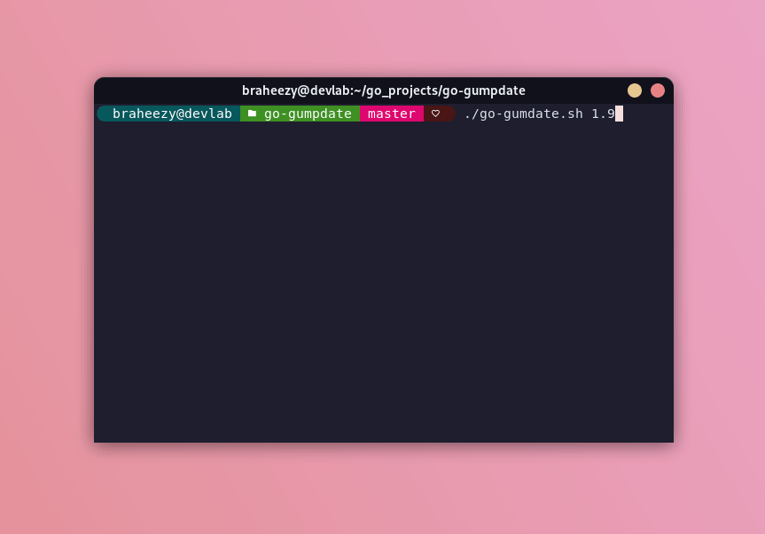

# go-gumpdate
Update Go versions with a pretty [Gum](https://github.com/charmbracelet/gum) updater script.

Just call the script with the version of Go you want. Any existing installation will be removed!!

```console
./go-gumdate.sh <version>
```

This script is probably prettier than smart. There's much better tools for [managing Go versions](https://go.dev/doc/manage-install).